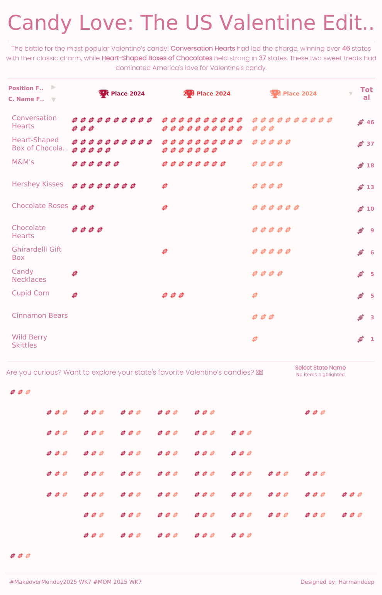

# 🍬 Candy Crush: The US Valentine Edition | #MakeoverMonday 2025 WK7

## 📌 About the Project
This is my first **#MakeoverMonday** entry! The challenge focuses on the most popular Valentine's Day candies across the US. The goal was to visualize which sweet treats dominated each state in 2024.

## 📊 Data Source
The dataset was provided by **MakeoverMonday** and includes:
- Popular Valentine's candies
- Ranking of top 3 candies in each state
- Total count of states favoring each candy

## 🔍 Key Insights
- 🏆 **Conversation Hearts** were the top choice in **46 states**  
- 🍫 **Heart-Shaped Chocolate Boxes** ranked second in **37 states**  
- 🍪 **M&M’s & Hershey Kisses** are gaining popularity  

## 🛠️ Features & Learnings
This project helped me explore:
- **Pivot tables** for better data organization and viszalisation
- **Tile charts** for a clean, structured view  
- **Shape customization** to make the dashboard visually engaging  
- **Tableau interactions** for better user experience  

## 🎮 Explore the Dashboard
👉 [View the interactive Tableau dashboard](https://rb.gy/xfim2p)

## 📸 Dashboard Preview

## 🚀 Next Steps
Looking forward to improving with each challenge and learning from the amazing **MakeoverMonday** community!  

---
### 📢 **Let's Connect!**
If you have feedback or ideas, feel free to connect with me on [LinkedIn](#).  

#DataViz #Tableau #MakeoverMonday #ValentinesCandy #DataStorytelling

